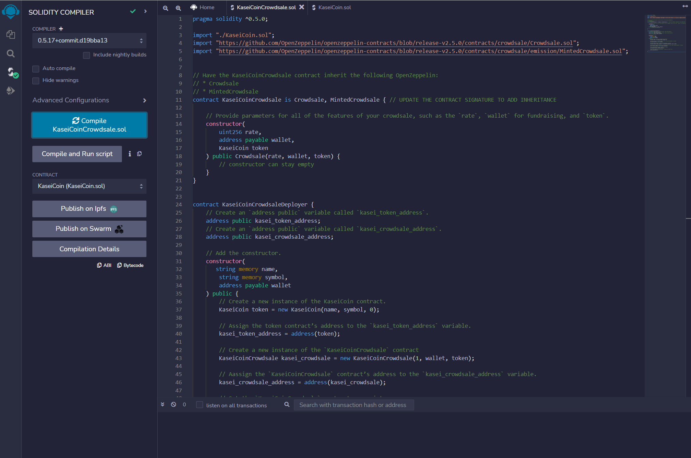
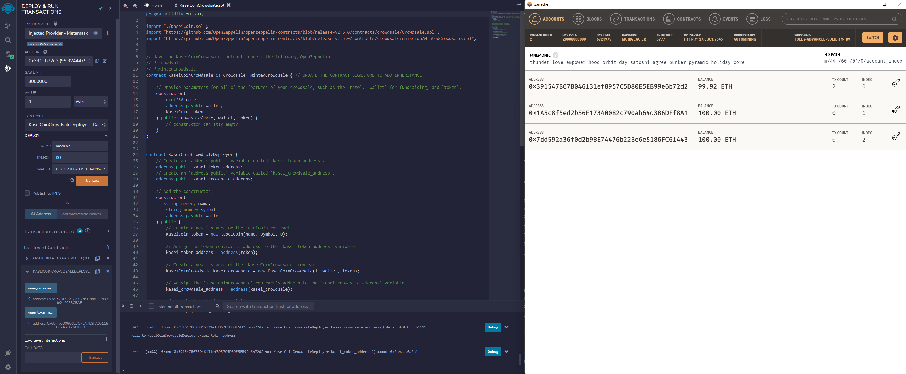
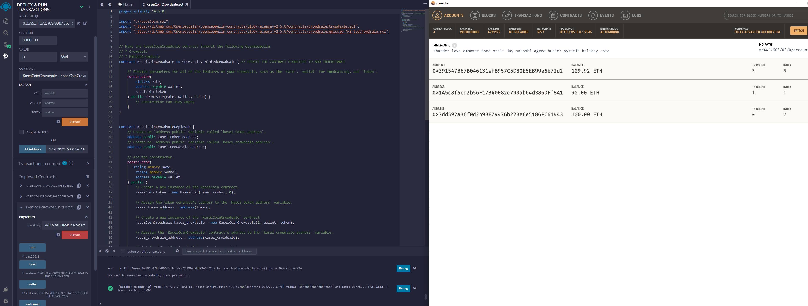
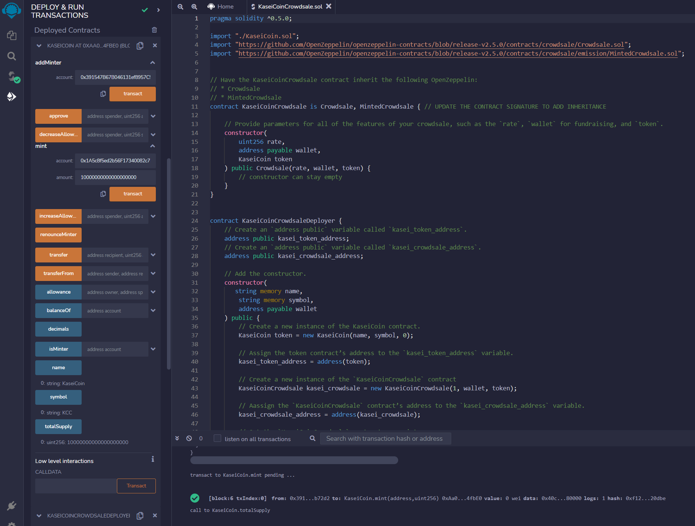
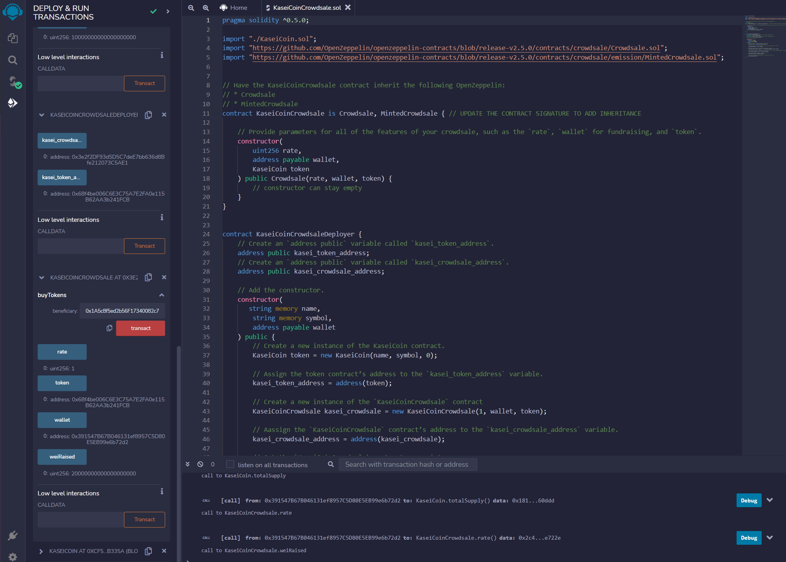

# advanced_solidity_homework

# Unit 21: Martian Token Crowdsale

View the Crowdsale code [Here](https://github.com/themichaelfoley/advanced_solidity_homework/blob/main/Kasei_Code/KaseiCoinCrowdsale.sol)

View the Coin code [Here](https://github.com/themichaelfoley/advanced_solidity_homework/blob/main/Kasei_Code/KaseiCoin.sol)

## Background

After waiting for years and passing several tests, the Martian Aerospace Agency selected you to become part of the first human colony on Mars. As a prominent fintech professional, they chose you to lead a project developing a monetary system for the new Mars colony. You decided to base this new system on blockchain technology and to define a new cryptocurrency named **KaseiCoin**. (Kasei means Mars in Japanese.)

KaseiCoin will be a fungible token that’s ERC-20 compliant. You’ll launch a crowdsale that will allow people who are moving to Mars to convert their earthling money to KaseiCoin.

[The full instructions for this assignment can be viewed here]()

## Compiled Code on Remix

## Contract Deployed

## Bought Tokens

## Total Supply of Tokens

## Wei Raised
